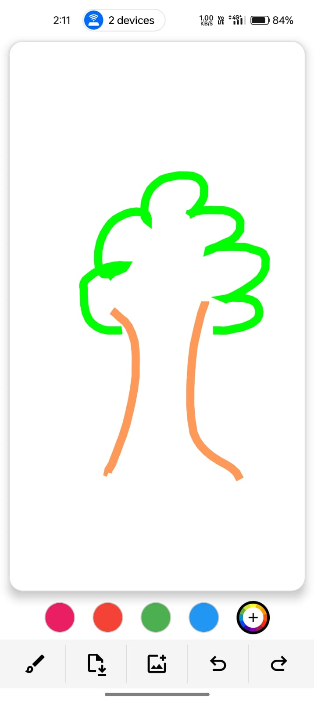
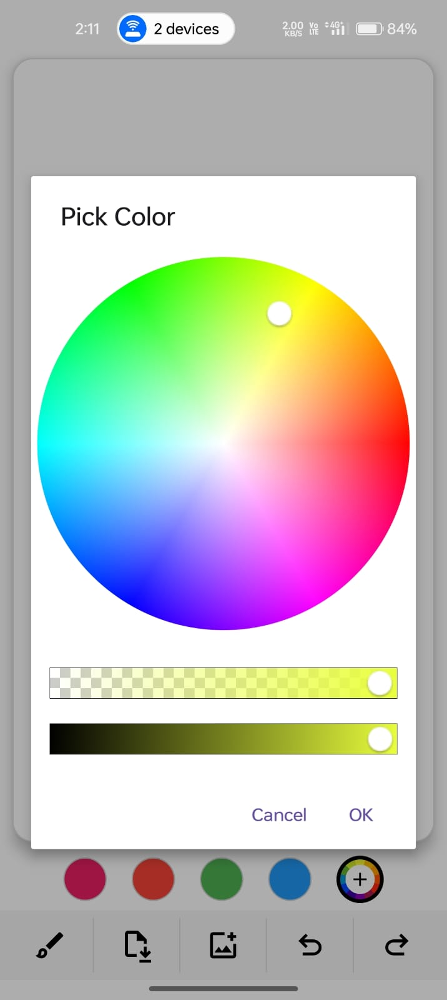
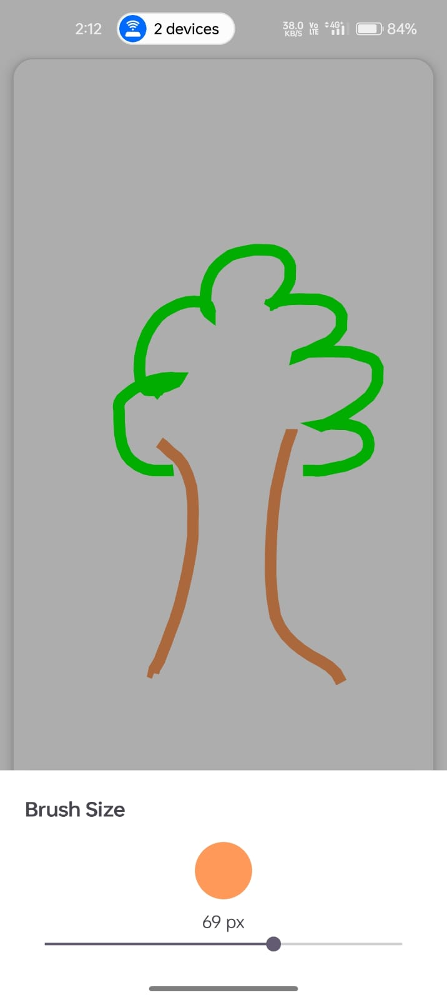

<div align="center">

# 🎨 DrawingApp

### *A smooth, interactive drawing experience — built for creativity on Android*

[](https://android.com)
[](https://kotlinlang.org)
[-orange?style=for-the-badge)](https://developer.android.com)
[](https://developer.android.com)

<br/>

> *A lightweight drawing app with real-time strokes, color selection, and undo/redo support*

<br/>

---

## 📥 Download & Install

### Try the app directly on your Android device!

<br/>

[](https://github.com/anup-Kumar2004/DrawingApp/releases/latest/download/app-release.apk)

<br/>

> ⚠️ You may need to allow installation from unknown sources.
> Go to **Settings → Security → Install unknown apps**

<br/>

| Step | Action |
|:----:|--------|
| **1** | 📲 Tap the **Download APK** button above on your Android phone |
| **2** | 📂 Open the downloaded file from your notifications or Downloads folder |
| **3** | ✅ Tap **Install** when prompted |
| **4** | 🎨 Start drawing! |

<br/>

**Requirements:** Android 5.0 (API 21) or higher · Lightweight · No account needed

---

</div>

## 📱 Screenshots

> *Add your screenshots here by replacing the placeholder paths below*

<div align="center">

| Drawing Canvas | Color Selection | Brush Size Control | Undo / Redo |
|:--------------:|:---------------:|:------------------:|:-----------:|
|  |  |  |  |

</div>

<br/>

---

## ✨ Features

<table>
<tr>
<td width="50%">

### 🎨 Drawing Experience
- Smooth real-time drawing on canvas
- Custom **Path-based rendering**
- Anti-aliased strokes for clean output
- Supports continuous finger gestures

</td>
<td width="50%">

### 🌈 Color Selection
- Predefined colors (Pink, Red, Green, Blue)
- Custom color picker with full spectrum
- Visual selection indicator

</td>
</tr>
<tr>
<td width="50%">

### ✏️ Brush Control
- Adjustable brush size via **SeekBar dialog**
- Dynamic stroke width updates in real-time

</td>
<td width="50%">

### 🔁 Undo / Redo
- Multi-step undo support
- Redo previously undone strokes
- Efficient stroke stack handling

</td>
</tr>
<tr>
<td width="50%">

### 🖼️ Background Support
- Set image as drawing background
- Draw on top of gallery images

</td>
<td width="50%">

### ⚡ Lightweight & Fast
- No heavy dependencies
- Optimized drawing performance
- Runs smoothly on low-end devices

</td>
</tr>
</table>

<br/>

---

## 🏗️ Tech Stack

| Category | Technology |
|----------|-----------|
| **Language** | Kotlin |
| **UI** | XML Layouts, ConstraintLayout |
| **Custom Drawing** | Canvas, Paint, Path |
| **Architecture** | Custom View-based approach |
| **Dialogs** | Android Dialog + SeekBar |
| **Color Picker** | Skydoves ColorPickerView |

<br/>

---

## 🗂️ Project Structure

```
app/src/main/
│
├── java/com/example/drawingapp/
│   ├── DrawingView.kt               # Custom View — canvas, paint, path logic
│   └── MainActivity.kt              # Main screen — toolbar, color, brush controls
│
├── res/
│   ├── layout/
│   │   ├── activity_main.xml
│   │   └── dialog_brush_size.xml
│   │
│   ├── drawable/
│   │   ├── circle_* files           # Color circle drawables
│   │   ├── circle_selector.xml      # Selection state drawable
│   │   ├── color_wheel.png
│   │   └── icons/                   # undo, redo, save, gallery icons
│   │
│   ├── values/
│   │   ├── colors.xml
│   │   ├── strings.xml
│   │   └── themes.xml
│   │
│   └── xml/
│       ├── backup_rules.xml
│       └── data_extraction_rules.xml
│
└── AndroidManifest.xml
```

<br/>

---

## 🚀 Getting Started

### Prerequisites
- Android Studio **Hedgehog** or later
- Android device / emulator running **API 21+**

### Installation

```bash
# 1. Clone the repository
git clone https://github.com/anup-Kumar2004/DrawingApp.git

# 2. Open in Android Studio
# File → Open → select the cloned folder

# 3. Let Gradle sync complete

# 4. Run on your device or emulator
# Click ▶ Run or press Shift+F10
```

<br/>

---

## 📦 Dependencies

```kotlin
// Color Picker
implementation("com.github.skydoves:colorpickerview:2.3.0")

// Material 3
implementation("com.google.android.material:material:1.11.0")
```

<br/>

---

## 🧠 Architecture Overview

```
User Touch → MotionEvent → Path → Canvas Draw
                               ↓
                       Stored as Stroke
                               ↓
                   Undo / Redo Stack System
                               ↓
                       View.invalidate()
```

<br/>

---

## 🙋‍♂️ About the Developer

<div align="center">

Built with ❤️ by **Anup Kumar**

*This project demonstrates custom Android View development including:*
*Canvas drawing · Paint & Path API · gesture handling · undo/redo stack logic*

<br/>

[](https://github.com/anup-Kumar2004)
[](https://linkedin.com/in/YOUR_LINKEDIN)

<br/>

*If you found this project helpful or interesting, please consider giving it a ⭐*

**© 2026 DrawingApp — Built with Kotlin & ☕**

</div>
